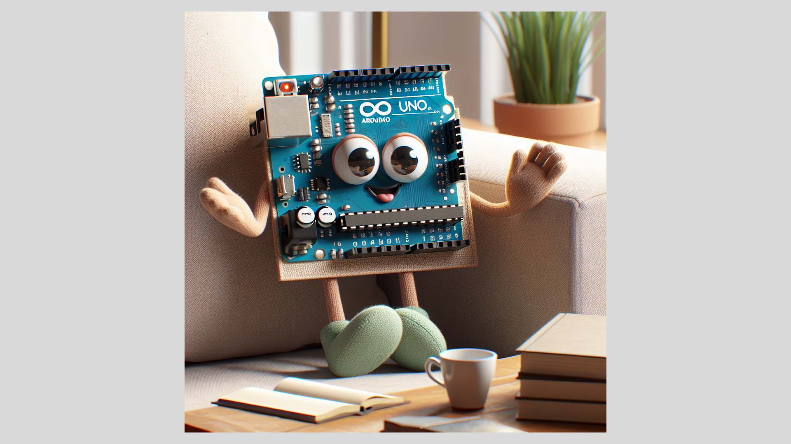

# VisionVerse
A Tkinter-based Python application that integrates OpenAI's API to perform text-to-image generation and image recognition, alongside offering interactive chat capabilities. Users can input textual descriptions to generate images, capture images using a webcam, and receive AI-powered insights about the contents of an image.


This application is a multifaceted tool designed for users to interact with OpenAI's powerful API through a simple and intuitive graphical interface built with Tkinter. It harnesses the capabilities of OpenAI's models to offer a range of functionalities including:
- response from ChatGPT 4 Turbo API
- generating image DALL-E 3 API
- taking snapshot from a webcam and interprets it using GPT 4 Vision API

## Screenshots

Application window.


Image recognition.


Fullscreen preview.


## Setup

Create ```.env``` file and put your OpenAI API Key there.

```
OPENAI_API_KEY=ab-YOURKEYEXAMPLEYOURKEYEXAMPLE
```

```
$ python3 -m venv venv
$ source venv/bin/activate
$ pip install -r requirements.txt
```

## Usage

```
$ python3 main.py
```